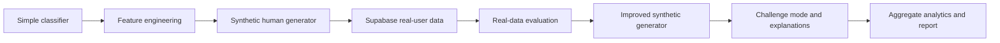
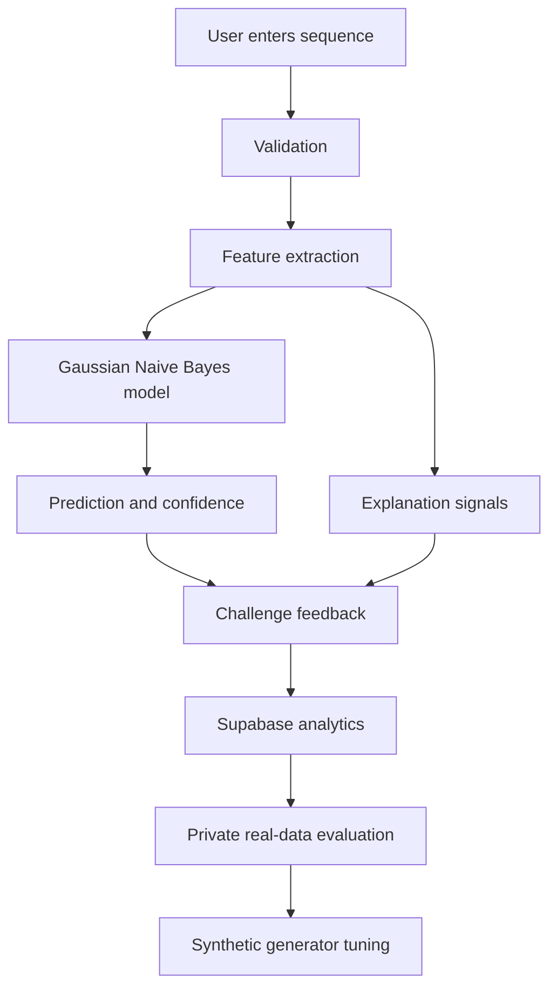

# Human Randomness Experiment

An interactive machine learning experiment that tests whether people can imitate randomness. Users type binary sequences, the app predicts whether each sequence is human-made or random, then explains the behavioral signals that gave the sequence away.

Live demo: https://human-random-detector-yeexavmafyev6jxjpgzpx9.streamlit.app/

For the full project narrative, evaluation results, and limitations, see [REPORT.md](REPORT.md).

## What This Project Became

This started as a small classifier for binary strings. It grew into a portfolio-grade behavioral ML system with a deployed app, Supabase-backed data collection, explainable predictions, real-data evaluation, aggregate analytics, calibration diagnostics, tests, and a written research report.

Figure 1: Project growth over time



## Why It Is Interesting

People often make "random" sequences too tidy. They avoid long streaks, alternate too often, keep 0s and 1s too balanced, and reuse short motifs. This project turns those habits into measurable features and a deployed experiment.

The app does not just say "Human" or "Random." It also tells the user why:

- alternation bias
- streak avoidance
- balance seeking
- repeated motif
- soft bit bias
- random-like/noisy behavior

## How The System Works

Figure 2: App and evaluation loop



## Key Features

- Five-round "Beat the model" challenge
- One-off sequence analysis
- Plain-language explanation cards
- Synthetic human data generation based on observed human biases
- Supabase logging for real submitted data
- Aggregate-only public analytics
- Private real-data evaluation scripts
- Calibration diagnostics
- Real-vs-synthetic feature comparison
- Automated tests for generation, features, evaluation, analytics, and explanations

## Model And Data

The current production model is a Gaussian Naive Bayes classifier trained on synthetic random and synthetic human-like sequences.

The random class is generated with true random bit selection. The human class is generated from weighted behaviors:

| Human behavior | Weight |
|---|---:|
| Near-alternating | 35% |
| Balanced and streak-avoidant | 25% |
| Chunk-pattern | 20% |
| Soft-biased | 10% |
| Noisy/random-like | 10% |

## Results

The synthetic generator upgrade improved holdout performance:

| Metric | Before | After |
|---|---:|---:|
| Synthetic accuracy | 0.785 | 0.880 |
| Synthetic ROC AUC | 0.833 | 0.922 |
| Human recall | 0.635 | 0.825 |

The stronger check was real app data. Against 378 labeled Supabase rows, the upgraded model stayed strong:

| Metric | Old baseline | Upgraded model |
|---|---:|---:|
| Real-data accuracy | 0.889 | 0.899 |
| Real-data ROC AUC | 0.958 | 0.944 |
| Human precision | 0.825 | 0.850 |
| Human recall | 0.863 | 0.863 |
| Random recall | 0.903 | 0.919 |

The model kept human recall stable while reducing false human predictions on random sequences.

## Project Structure

```text
human-random-detector/
  src/
    app.py                    Streamlit app
    features.py               Feature extraction
    explanations.py           Plain-language explanation signals
    generate_data.py          Synthetic random/human generators
    train_model.py            Training and synthetic evaluation
    evaluate_real_data.py     Private real-data evaluation
    analyze_real_patterns.py  Real behavior pattern analysis
    compare_synthetic_real.py Real-vs-synthetic feature comparison
  tests/                      Pytest suite
  model.pkl                   Trained model artifact
  scaler.pkl                  Trained scaler artifact
  evaluation_report.json      Synthetic evaluation report
  supabase_schema.sql         Supabase schema and aggregate view
  REPORT.md                   Full write-up
```

## Run Locally

```powershell
git clone https://github.com/jarems421/human-random-detector.git
cd human-random-detector
pip install -r src/requirements.txt
streamlit run src/app.py
```

## Reproduce Training

```powershell
python src/train_model.py
```

## Run Tests

```powershell
python -m py_compile src\app.py src\features.py src\evaluate_real_data.py src\analyze_real_patterns.py src\explanations.py src\analytics_summary.py src\calibration.py src\compare_synthetic_real.py src\train_model.py
.\venv\Scripts\python.exe -m pytest
```

## Supabase Notes

The public app uses the anon key for inserts and aggregate analytics. Raw submitted sequences are reserved for private evaluation scripts using `SUPABASE_SERVICE_ROLE_KEY`.

To set up the database, run the full contents of [supabase_schema.sql](supabase_schema.sql) in the Supabase SQL Editor.

## What I Learned

- Synthetic data quality matters as much as model choice.
- Real-data evaluation is the only reliable way to judge whether a synthetic generator matches human behavior.
- Interpretable features make the app more educational and easier to debug.
- Privacy changes affect both the app and the evaluation pipeline.
- A small ML model can become a much stronger project when it includes deployment, data collection, testing, and a clear research story.

## License

MIT License
