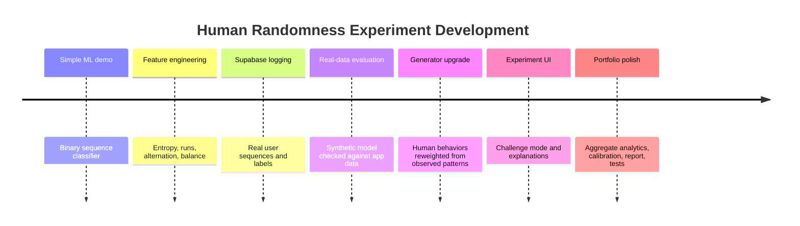
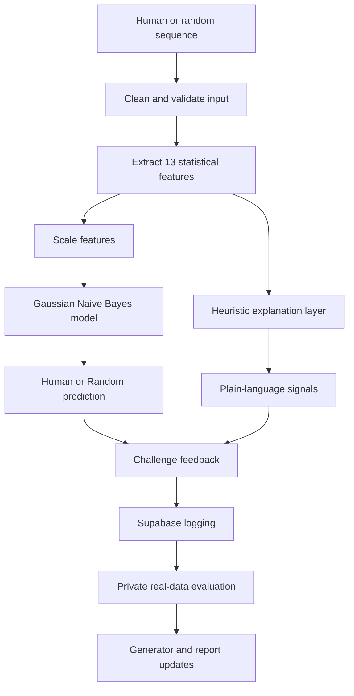
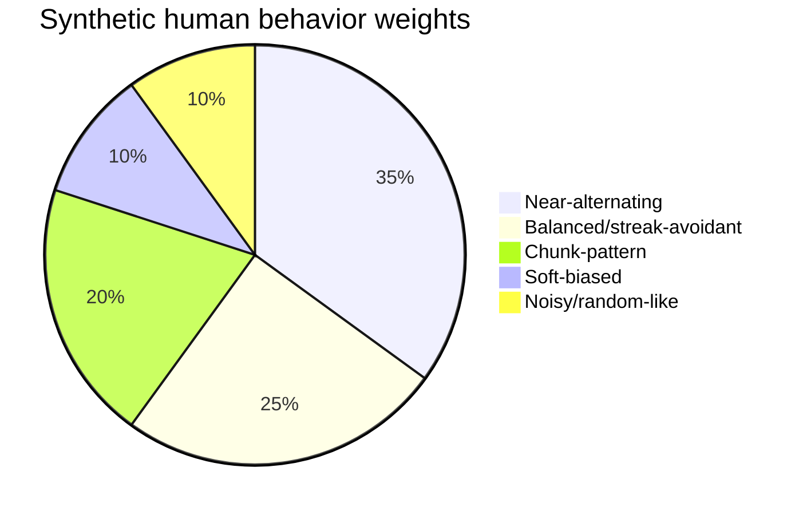
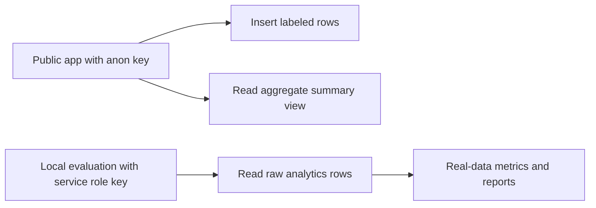

# Human Randomness Experiment Report

## 1. Project Story

The first version of this project was a simple idea: train a model to decide whether a binary sequence came from a human or from a random generator. That was already a neat demo, but the project became much stronger once it started asking a better question:

Can we measure the specific ways people fail to imitate randomness?

The answer became the shape of the final system. The app now lets users try to fool the model, explains the behavioral patterns in their sequences, logs real submitted data, compares synthetic and real data, and reports calibration alongside ordinary accuracy metrics.

Figure 1: How the project evolved



## 2. Problem And Hypothesis

People tend to make random-looking sequences too orderly. When asked to type 0s and 1s at random, they often:

- alternate too frequently
- avoid long streaks
- keep the counts of 0 and 1 too balanced
- repeat short motifs such as `001`, `010`, or `101`
- use a mild preference for one bit

The hypothesis is that these habits create measurable structure. A model should be able to separate human-made sequences from true random sequences using interpretable statistical features.

The psychological implication is that "randomness" is not only a mathematical property; it is also something people have intuitions about. Those intuitions are often biased toward fairness, balance, and visible variety. A long streak such as `00000` feels suspicious to many people, even though streaks are a normal part of true randomness. This app makes that mismatch visible.

That gives the project a behavioral science layer. The model is not just detecting bad randomness; it is detecting the traces of human expectation, pattern avoidance, and the desire to make disorder look deliberate.

## 3. System Overview

Figure 2: Prediction and learning loop



The deployed app has five main parts:

- Challenge: five attempts to fool the model
- Analyze: one-off sequence prediction
- Collect Data: known-source data collection
- Analytics: aggregate public metrics only
- About: project explanation inside the app

## 4. Feature Engineering

Each sequence is converted into 13 features:

| Feature | Why it matters |
|---|---|
| Entropy | Low entropy suggests an uneven symbol distribution. |
| Markov entropy | Captures transition variety between adjacent bits. |
| KL divergence | Measures deviation from a 50/50 bit distribution. |
| Longest run | Humans often avoid long streaks. |
| Alternation rate | Humans often switch too frequently. |
| Balance deviation | Humans often balance 0s and 1s too carefully. |
| Lag-1 autocorrelation | Captures dependence between neighboring bits. |
| Run count | Measures how often the sequence changes runs. |
| Mean run length | Summarizes streak structure. |
| Alternation deviation | Distance from random-like switching. |
| Longest alternating run | Detects long `0101...` structures. |
| Near-alternation score | Measures closeness to perfect alternation. |
| Pattern break rate | Counts disruptions in alternating patterns. |

The feature set is intentionally interpretable. The same measurements support both model prediction and explanation cards in the app.

## 5. Synthetic Data: Before And After

The first synthetic human generator used a small set of behaviors selected uniformly. It included too many noisy human examples that looked almost indistinguishable from true random data. That made the synthetic class less focused on the human biases seen in real Supabase data.

The upgraded generator keeps the random class unchanged and reweights the human class:

Figure 3: Upgraded synthetic human mix



This generator better represents broad human randomness mistakes without overfitting to one person's style.

## 6. Evaluation Results

Synthetic holdout metrics improved after the generator upgrade:

| Metric | Before | After | Change |
|---|---:|---:|---:|
| Synthetic accuracy | 0.785 | 0.880 | +0.095 |
| Synthetic ROC AUC | 0.833 | 0.922 | +0.089 |
| Human precision | 0.907 | 0.927 | +0.020 |
| Human recall | 0.635 | 0.825 | +0.190 |
| Random precision | 0.719 | 0.842 | +0.123 |
| Random recall | 0.935 | 0.935 | 0.000 |

The real test was Supabase data collected through the app. Against 378 labeled real rows:

| Metric | Old baseline | Upgraded model | Change |
|---|---:|---:|---:|
| Real-data accuracy | 0.889 | 0.899 | +0.010 |
| Real-data ROC AUC | 0.958 | 0.944 | -0.014 |
| Human precision | 0.825 | 0.850 | +0.025 |
| Human recall | 0.863 | 0.863 | 0.000 |
| Random precision | 0.925 | 0.927 | +0.002 |
| Random recall | 0.903 | 0.919 | +0.016 |

The key result is that human recall stayed stable while human precision and random recall improved. That means the upgraded generator did not merely make synthetic testing easier; it also transferred well to real submitted data.

## 7. Explainability Layer

The app now translates features into plain-language signals:

| Signal | Example interpretation |
|---|---|
| Alternation bias | "You switched between 0 and 1 more often than true random usually does." |
| Streak avoidance | "The longest streak is very short." |
| Balance seeking | "The number of 0s and 1s is almost perfectly balanced." |
| Repeated motif | "The sequence leans on a repeated short pattern." |
| Soft bit bias | "The sequence favors one bit more than expected." |
| Random-like | "This sequence is harder to separate from true random." |

This layer is heuristic. It explains the visible sequence patterns, not the exact internal causal path of the Naive Bayes classifier. That is a deliberate choice: the goal is to make the model educational and inspectable for users.

## 8. Analytics And Privacy

The app originally exposed recent raw rows for convenience. The upgraded version moves toward aggregate-only public analytics. Public visitors can see counts and rates, but raw submitted sequences and session identifiers are reserved for private evaluation scripts.

Figure 4: Public vs private data access



This keeps the deployed app useful while reducing unnecessary exposure of user-submitted data.

## 9. Calibration

The project now reports calibration diagnostics, including Brier score and confidence buckets. Calibration asks whether the model's probabilities behave like probabilities. If the model says "80% human," then around 80% of those examples should actually be human.

The current production model is not automatically calibrated. The diagnostics are reported first so future calibration can be justified by evidence rather than added by default.

## 10. Testing

The test suite covers:

- feature extraction
- synthetic data generation
- prediction validation
- real-data evaluation
- duplicate handling
- aggregate analytics summaries
- explanation signal classification
- real-pattern analysis

Current verification:

```text
43 tests passed
```

## 11. Limitations

- The production model is still trained on synthetic data only.
- The real-data sample is useful but still modest.
- Explanations are heuristic and should be treated as readable diagnostics.
- Very short sequences are inherently noisy.
- User behavior may change after seeing feedback from the app.

## 12. Future Work

- Add a carefully separated real-data retraining pipeline.
- Track model versions across every logged prediction.
- Add richer charts for feature distributions over time.
- Evaluate calibration on larger real datasets.
- Explore whether the same approach works for longer sequences or non-binary randomness tasks.

## 13. Why This Is A Strong Portfolio Project

This project demonstrates more than a classifier. It shows the full loop:

- behavioral hypothesis
- synthetic data design
- feature engineering
- model training
- deployed app
- real-user data collection
- privacy-aware analytics
- real-data evaluation
- explanation UX
- reproducible tests and reports

That makes it a complete experiment rather than a standalone ML demo.

The psychology also gives the project a memorable hook. Many ML demos classify objects or predict labels, but this one invites the user to participate and then shows them something about their own intuition. That makes the app easier to explain, easier to demo, and more distinctive in a portfolio.
